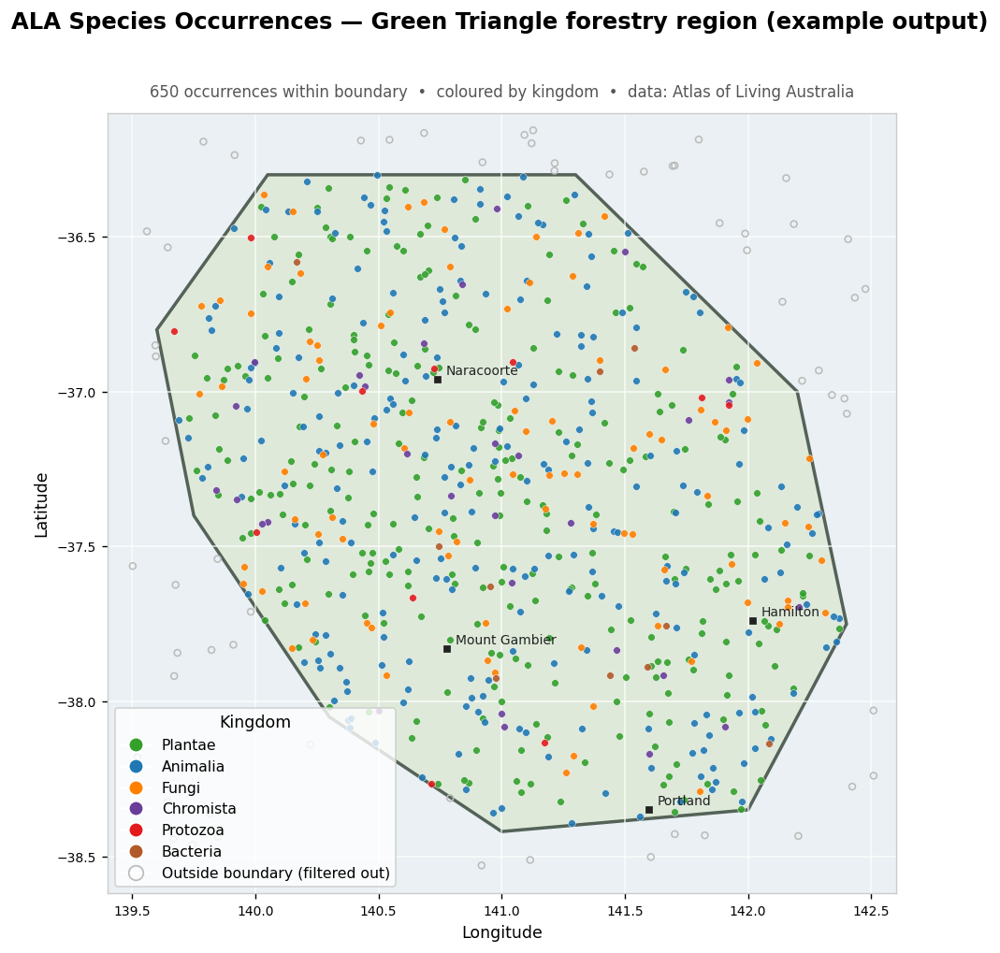

# ALA Species Mapper

Fetch species occurrence records from the **Atlas of Living Australia (ALA)**
inside any boundary polygon, filter them precisely to that boundary, and turn
them into an interactive map, GIS-ready files, or a live ArcGIS Online layer.

Built around a real-world biodiversity monitoring workflow for forestry land
management, then generalised so anyone can run it on a public conservation area.



*Example output: recent occurrences fetched from ALA and clipped to a boundary
polygon (Royal National Park, NSW). Open circles are records that fell inside
the bounding box but outside the actual polygon — they are filtered out.*

---

## Why this project

Government and open biodiversity APIs are messy: paging limits, rate limits,
inconsistent fields, and hard record caps. This project is a small, honest case
study in building a **resilient data pipeline** around one of them:

- **Handles ALA's 5,000-record query cap** with recursive binary date-range
  splitting — a month with 12,000 records is automatically split into halves
  until every slice fits.
- **Works around a real API quirk:** ALA silently drops the `uuid` field when
  you use its `fl` (field list) parameter. The pipeline fetches full records and
  slims them in Python instead, so de-duplication by `uuid` actually works.
- **Bounding box → true polygon.** ALA can only query a rectangle, so records are
  fetched by bounding box and then clipped to the exact boundary with a prepared
  Shapely geometry.
- **Graceful degradation:** an API health check (traffic-light) up front, retries
  with backoff, and clear logging throughout.

## Try it in 60 seconds (no account needed)

The demo uses only the **public** ALA API — no keys, no logins.

```bash
git clone https://github.com/<tcynh-happy>/ala-species-mapper.git
cd ala-species-mapper
python -m venv .venv && source .venv/bin/activate   # Windows: .venv\Scripts\activate
pip install -r requirements.txt
python demo.py
```

This writes three files to `output/`:

| File | What it is |
|------|------------|
| `demo_map.html` | Interactive Leaflet map — open it in any browser |
| `demo_species.geojson` | GIS-ready points (QGIS, ArcGIS, geopandas, …) |
| `demo_species.csv` | Flat table of every occurrence |

Options: `python demo.py --months 12` to widen the look-back window.

## Architecture

```
          ALA biocache API                 boundary polygon (GeoJSON)
                 │                                    │
                 ▼                                    ▼
        ┌──────────────────┐   bbox query   ┌──────────────────┐
        │  src/ala_client  │───────────────▶│     src/geo      │
        │ paging · retries │                │ clip to polygon  │
        │ 5k auto-split    │                │ dedup · filters  │
        └──────────────────┘                └──────────────────┘
                                                     │
                             ┌───────────────────────┴───────────────┐
                             ▼                                        ▼
                   ┌──────────────────┐                    ┌──────────────────┐
                   │   src/mapping    │                    │ src/arcgis_sink  │
                   │ CSV · GeoJSON ·  │                    │  push to ArcGIS  │
                   │ Folium map       │                    │  Online layer    │
                   └──────────────────┘                    └──────────────────┘
                        (demo.py)                               (main.py)
```

Each module has one job, so the ALA client and geometry logic are reusable
outside this project.

## Project layout

```
ala-species-mapper/
├── demo.py                 # zero-auth demo: ALA → map + CSV + GeoJSON
├── main.py                 # full pipeline: ALA → ArcGIS Online
├── src/
│   ├── ala_client.py       # ALA API client: paging, retries, date-split
│   ├── geo.py              # boundary load, clip, dedup, marine filter (Shapely)
│   ├── mapping.py          # CSV / GeoJSON / Folium map builders
│   ├── arcgis_sink.py      # optional ArcGIS Online upload
│   └── config.py           # env-based configuration
├── data/demo_boundary.geojson   # public sample boundary
├── docs/preview_map.png         # example output (above)
├── requirements.txt
└── .env.example
```

## The full pipeline (ArcGIS Online)

`main.py` extends the demo to sync into a hosted ArcGIS Online Feature Layer,
with two modes:

| Mode | Command | Behaviour |
|------|---------|-----------|
| Weekly (default) | `python main.py` | Fetch recent months, append only new `uuid`s |
| Full | `python main.py --full` | Re-fetch from `ALA_START_YEAR`, replace everything |

It reads all credentials and the boundary service URL from a local `.env`
(copy `.env.example`), so **nothing sensitive is committed to the repo**. Install
the ArcGIS SDK first: `pip install arcgis`.

## Engineering notes

- **No GeoPandas dependency.** Point-in-polygon uses Shapely + a prepared
  geometry, so `pip install` works on every platform (GeoPandas' GDAL/GEOS/PROJ
  stack is a common Windows install headache). This keeps the demo one command.
- **Connection pooling** via a single `requests.Session`.
- **Config over code:** tuning (page size, retries, look-back window) lives in
  `config.py` / environment variables, not scattered through the logic.
- **Secrets hygiene:** `.env` and generated data are git-ignored; the repo ships
  a `.env.example` template only.

## Tech stack

Python · `requests` · `pandas` · `shapely` · `folium` (Leaflet) ·
ArcGIS Python API · Atlas of Living Australia REST API

## Data & licence

Occurrence data comes from the [Atlas of Living Australia](https://www.ala.org.au/)
under CC-BY. Code is released under the [MIT License](LICENSE).

## Author

Chen-Yang Tsai — Forester & Resource Analyst.
<https://github.com/tcynh-happy>
<chenyangtsai0414@gmail.com>
